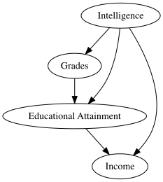

The Learning System Causal Model Library
================

A place to collect and share causal models of learning systems. The
focus here is (initially) on Graphical Causal Models (GCMs), including
causal Directed Acyclic Graphs (DAGs)

> The models here should be treated as works in progress, created within
> a particular context. Learning is messy complex, and there are
> multiple (valid) ways to represent the same system.

There are not many models of learning systems out there, but those that
are publicly available we can try and collect here, pointing to the
paper they are from.

(add license info here - when sorted out)

## Using this library

### The DOT language, and key metadata

The language used to save diagrams in tools like
[DAGitty](https://dagitty.net/learn/index.html) and the related R
Packages is called the [DOT
language](https://graphviz.org/doc/info/lang.html). It is highly
customisable but not everything needs to be included to share what is
meaningful for a causal model. More importantly there are things that we
*should* include that are not the default in some tools, such as in
DAGitty.

Moreover, there are key features that we should include so that these
models are more readily transferable to other contexts, such as:

- An outline of the **Model Context**: what system is trying to be
  modelled, in what circumstances? I believe this should also include
  how the model was conceptualised, so if the model was:
  - purely *illustrative* (there are some that are used as a teaching
    example);
  - *derived from literature*, such as representation of a theory;
  - *elicited from experts*, or;
  - *learned from data*, or;
  - some combination of the above.
- A **Node Description** of each node, ideally in some detail. If we say
  “Student Knowledge” what is it exactly?
- A **DOI** if the model appeared in a paper, or
- **URL** if there is a relevant online source of the model to refer to.
- …anything else? This list is still in draft - aiming for a minimally
  sufficient list of compulsory graph meta-data and perhaps some
  optional extras.

To illustrate, here is a DAG using the DOT language and then displaying
using the `DiagrammeR` package:

``` r
library(DiagrammeR)

# these are just needed for handling the github_document format
library(DiagrammeRsvg)
library(rsvg)
```

    ## Linking to librsvg 2.61.0

``` r
# The graph is defined as a text string, using the DOT language
# Note this uses the 'digraph' type rather than the 'dag' in DAGitty
rohrer.2018.fig2 <- '
digraph {

// A block of data about the model
// the "context" field should *always* be included.
context="This model is for illustation only, but describes a relationship involving education.";
doi="https://doi.org/10.1177/2515245917745629";

// A block of data about the nodes
// The "label" field is how the node is displayed, and a "description" field should 
// always be included, and ideally err on the side of being overly descriptive.
G [label="Grades", description = "A persons grades over a long period of tie"]
Int [label="Intelligence", description = "A persons natural or general level of intelligence"]
EA [label="Educational Attainment", description = "A persons natural or general level of intelligence"]
Inc [label="Income", description="A persons income"]

// A block of data about the edges
Int -> G;
Int -> Inc;
Int -> EA;
G -> EA;
EA -> Inc;
}
'

# This code plots
# grViz(rohrer.2018.fig2)

# But we need fiddle by exporting to deal with github_document restrictions
grViz(rohrer.2018.fig2) |>
    export_svg() |>
    charToRaw() |> 
    rsvg_svg("readme_diagram_1.svg")
```

<figure>

<figcaption aria-hidden="true">An illustrative example of a causal DAG
used in Rohrer (2018)</figcaption>
</figure>

Although the text string is enough to define each model I have begun to
describe each model, or set of models, in a single `.R` script so it can
contain comments and be read into R via `source(thefile.R)`. An example
here are the three models in this repo from Julia Rohrer’s
[paper](https://doi.org/10.1177/2515245917745629) that are related to
education.

Note that DAGitty includes details about *outcome* and *exposure*, which
are useful but specific to the research question, not to the causal
model:

    dag {
    A [selected,pos="-2.200,-1.520"]
    B [pos="1.400,-1.460"]
    D [outcome,pos="1.400,1.621"]
    E [exposure,pos="-2.200,1.597"]
    Z [adjusted,pos="-0.300,-0.082"]
    A -> E
    A -> Z [pos="-0.791,-1.045"]
    B -> D
    B -> Z [pos="0.680,-0.496"]
    E -> D
    }

### Tools for drawing models

- [DAGitty](https://dagitty.net/dags.html)
- [Loopy v2](https://efa.unisa.edu.au/Loopy/)
  ([v3](https://github.com/benwhicks/loopy) in the works, or check out
  the [original](https://ncase.me/loopy/) by the brilliant Nicky Case)

### Tools for manipulation

…coming. I have lots of code, based on the `dagitty` and `tidygraph` R
packages, but it needs some organising first. We will need functions to
move from and to DAGitty and other tools and the more flexible DOT
language.

## Learning more

See [this list of
resources](https://sites.google.com/view/lak26-workshop-gcm-for-la/further-reading).
