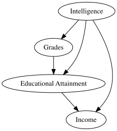

The Learning System Causal Model Library
================
2026-09-19

A place to collect and share causal models of learning systems. The
focus here is (initially) on graphical causal models (**GCM**s),
including causal directed acyclic graphs (**DAG**s)

> The models here should be treated as works in progress, created within
> a particular context. Learning is messy complex, and there are
> multiple (valid) ways to represent the same system.

There are not many models of learning systems out there (yet!), but
those that are publicly available we can try and collect here, pointing
to the paper they are from.

This repository uses a dual license. Code (R scripts, parsers, site
tooling) is released under the MIT License - reuse, modify, and
redistribute freely, with attribution. The causal models themselves are
released under CC BY 4.0: you're free to reuse and adapt them provided
you credit the original work, which is indicated in a model's metadata
(either a DOI or URL).

# Exploring the models

...to come...

# Using this library

## Describing models, nodes, edges

There are key features that we should include so that these models are
more readily transferable to other contexts. We split this into
meta-data for the **model**, **nodes** and **edges**.

### Models

> #### *Model* meta data
>
> An outline of the **Model Context**: what system is trying to be
> modelled, in what circumstances? For models sampled from literatue I
> have often simply copied the figure description.
>
> A **tags** attribute, which at a minimum should include how the model
> was conceptualised, so if the model was:
>
> - purely *illustrative* (there are some that are used as a teaching
>   example);
> - *derived-from-literature*, such as representation of a theory;
> - *elicited-from-experts*, or;
> - *learned-from-data*, such as causal discovery, or;
> - some combination of the above.
>
> Additional tags can be added to support searchable models in the
> future.
>
> The **doi** or **url** to where the model was sourced from, if
> applicable.

### Nodes

> #### *Node* meta data
>
> A **label** attribute for how to display the text of the node on the
> graph.
>
> A node **description** attribute that outlines exactly what the node
> represents. Ideally this should err on the side of over-explaining
> than under. If we say "Student Knowledge" -- what exactly do we mean
> *in this model* by that?
>
> *Optional*: A **cluster** attribute to indicate how the model could be
> coarsened to fewer nodes. (Such as is work on cluster DAGs or causal
> abstractions).

### Edges

There are a range of edges used in typical graphical causal models, with
the predominant being $A \rightarrow B$ to indicate that $A$ influences
$B$ directly. However, we need a consistent representation for storing a
variety of models. In a graph **skeleton** an undirected edge, $-$, is
used to show causal connection without confirming direction. An acyclic
directed mixed graph (**ADMG**) use $A \leftarrow\!\rightarrow B$ as
shorthand for a latent confounding structure,
$A \leftarrow U \rightarrow B$, and importantly this is *not* used to
represent cause flowing both ways. A partial ancestral graph (**PAG**)
also uses this shorthand for unmeasured confounding factors, as well as
a hollow dot as an endpoint to represent uncertainty in the algorithm
used to learn the graph. A PAG has $\circ\mkern-8mu\rightarrow$ to
indicate that the edge is either $\rightarrow$ or
$\leftarrow\!\rightarrow$, but not $\leftarrow$; whilst the edge
$\circ\mkern-8mu-\mkern-8mu\circ$ is used for uncertainty in both
directions.

> #### *Edge* meta data
>
> The **type** of edge. This will typically be *causal*, but there are
> other options that are utilised by certain models.
>
> - *causal* edge, which can be directed `->` or undirected `--`. The
>   causal undirected edge `--` says nothing about the direction, only
>   that the two nodes are not independent -- they are causally
>   connected somehow, but there is no knowledge of the direction, or if
>   there is some underlying . Note that a causal bidirected edge is not
>   to be used, as this is typically used for a latent confound (see
>   below), and it is better practice to include both $A \rightarrow B$
>   and $B \rightarrow A$ to represent feedback between two nodes,
>   rather than the ambiguous $A \leftarrow\!\rightarrow B$.
> - *confound* edge, which is used to represent a latent (unmeasured)
>   confound. This will be bidirected `<->` and if required distinguish
>   these with dashed style for the edge (so `[style = dashed]` instead
>   of `[style = solid]`)
> - *possible-causal* edge, for edges that are causal but we are
>   uncertain about its existance, but know something about the
>   direction. These should be only directed `->` and a different style,
>   such as `[style = dashed]` or `[style = dotted]`.
> - *proposed* edge for the PAG edge types with uncertainty (so
>   $\circ\mkern-8mu\rightarrow$ and $\circ\mkern-8mu-\mkern-8mu\circ$).
>   This needs its own category because they might end up being either
>   *causal* or *confound* with more information. This edge type can
>   also be used throughout in structure learning DAGs / PAGs if
>   desired.

## Model syntax

The language used to save diagrams in tools like
[DAGitty](https://dagitty.net/learn/index.html) and the related R
Packages is called the [DOT
language](https://graphviz.org/doc/info/lang.html). It is highly
customisable but not everything needs to be included to share what is
meaningful for a causal model. More importantly there are things that we
*should* include that are not the default in some tools, such as in
DAGitty.

A more in-depth tour of some options are in the [graphical causal
modelling
syntax](%7B%%20link%20graphical-causal-modelling-syntax.md%20%%7D)
document.

To illustrate, here is a DAG using the DOT language and then displaying
using the `DiagrammeR` package:

``` r
library(DiagrammeR)

# these are just needed for handling the github_document format
library(DiagrammeRsvg)
library(rsvg)
```

    ## Linking to librsvg 2.61.0

``` r
# The graph is defined as a text string, using the DOT language
# Note this uses the 'digraph' type rather than the 'dag' in DAGitty
rohrer.2018.fig2 <- '
digraph {

// Model
// the "context" field should *always* be included.
context="This model is for illustation only, but describes a relationship involving education.";
doi="https://doi.org/10.1177/2515245917745629";

// Nodes
// The "label" field is how the node is displayed, and a "description" field should 
// always be included, and ideally err on the side of being overly descriptive.
G [label="Grades", description = "A persons grades over a long period of tie"]
Int [label="Intelligence", description = "A persons natural or general level of intelligence"]
EA [label="Educational Attainment", description = "A persons natural or general level of intelligence"]
Inc [label="Income", description="A persons income"]

// Edges
Int -> G;
Int -> Inc;
Int -> EA;
G -> EA;
EA -> Inc;
}
'
```

``` r
# This code plots
grViz(rohrer.2018.fig2)
```

<figure>

<figcaption aria-hidden="true">An illustrative example of a causal DAG
used in Rohrer (2018)</figcaption>
</figure>

Although the text string is enough to define each model I have begun to
describe each model, or set of models, in a single `.R` script so it can
contain comments and be read into R via `source(thefile.R)`. An example
here are the three models in this repo from Julia Rohrer's
[paper](https://doi.org/10.1177/2515245917745629) that are related to
education.

Note that DAGitty includes details about *outcome* and *exposure*, which
are useful but specific to the research question, not to the causal
model:

    dag {
    A [selected,pos="-2.200,-1.520"]
    B [pos="1.400,-1.460"]
    D [outcome,pos="1.400,1.621"]
    E [exposure,pos="-2.200,1.597"]
    Z [adjusted,pos="-0.300,-0.082"]
    A -> E
    A -> Z [pos="-0.791,-1.045"]
    B -> D
    B -> Z [pos="0.680,-0.496"]
    E -> D
    }

## Tools for drawing models

- [DAGitty](https://dagitty.net/dags.html)
- [Loopy v4](https://github.com/benwhicks/loopy) - requires download and
  run locally at this stage, or check out the
  [original](https://ncase.me/loopy/) by the brilliant Nicky Case.

## Tools for manipulation

...coming. I have lots of code, based on the `dagitty` and `tidygraph` R
packages, but it needs some organising first. We will need functions to
move from and to DAGitty and other tools and the more flexible DOT
language.

# Learning more

See [this list of
resources](https://sites.google.com/view/lak26-workshop-gcm-for-la/further-reading).
